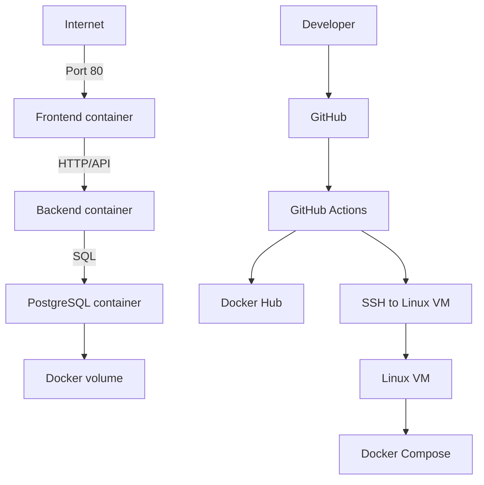

# FormFlow

FormFlow is a simple 3-tier SaaS-style form management application built for a Cloud & DevOps bootcamp capstone. It demonstrates a frontend container, a backend REST API container, a PostgreSQL database container, Docker Compose orchestration, Docker Hub image publishing, and GitHub Actions CI/CD deployment to a Linux VM.

## Project Overview

Users can:

- create forms
- view forms
- delete forms
- check backend health
- verify the currently deployed version

The application is intentionally simple so the infrastructure, deployment, rollback, and operational workflow are easy to understand and demo.

## Architecture



### Tier boundaries

- **Frontend**: React UI, user interaction, API consumption, status/version display.
- **Backend**: REST API, validation, business logic, database access, health/version endpoints.
- **Database**: Persistent PostgreSQL storage for form records.

## Technology Stack

- React
- Vite
- HTML / CSS / JavaScript
- Node.js
- Express.js
- PostgreSQL
- Docker
- Docker Compose
- GitHub Actions
- Docker Hub
- Ubuntu Linux VM deployment

## Repository Structure

- `frontend/` — React app and frontend Dockerfile
- `backend/` — Express API and backend Dockerfile
- `database/init/` — PostgreSQL schema initialization SQL
- `.github/workflows/main.yml` — validation, build, push, deploy workflow
- `docker-compose.prod.yml` — production compose file used on the VM
- `scripts/` — small helper scripts for local verification and deployment
- `docs/screenshots/` — evidence screenshots for the capstone
- `docker-compose.yml` — local and production deployment composition
- `.env.example` — environment variable template
- `DESIGN.md` — architecture and operational design decisions
- `ROLLBACK.md` — rollback procedure
- `INCIDENT-REPORT.md` — incident postmortem template/report

## Local Development

1. Copy `.env.example` to `.env` and update values if needed.
2. Start the stack:

```bash
docker compose up --build
```

3. Open the app at:

- `http://localhost`

The frontend proxies API requests to the backend service inside the Docker network.

## Environment Variables

Use `.env.example` as the source of truth for runtime variables.

Important variables include:

- `FRONTEND_PORT`
- `BACKEND_PORT`
- `APP_VERSION`
- `VITE_API_URL`
- `DATABASE_HOST`
- `DATABASE_PORT`
- `DATABASE_NAME`
- `DATABASE_USER`
- `DATABASE_PASSWORD`
- `DOCKERHUB_USERNAME`
- `FRONTEND_IMAGE`
- `BACKEND_IMAGE`

Only `DATABASE_PASSWORD`, `DOCKERHUB_TOKEN`, and `VM_SSH_KEY` are secrets. The database name and user are ordinary environment values.

Never commit real secrets. Keep `.env` local or store sensitive values in GitHub Secrets.

## Docker Usage

Build and run locally:

```bash
docker compose up --build
```

To rebuild just the images:

```bash
docker compose build
```

To stop and remove containers:

```bash
docker compose down
```

The database persists through container restarts using the named volume `postgres_data`.

## CI/CD

The GitHub Actions workflow in `.github/workflows/main.yml` performs:

1. validation
2. Docker image build
3. versioned Docker tagging using the Git commit SHA
4. push to Docker Hub
5. SSH deployment to a Linux VM
6. deployment verification with HTTP checks

The pipeline is designed to stop on validation failure so broken code is never deployed.

## Docker Hub

The repository expects two Docker Hub images:

- `formflow-frontend`
- `formflow-backend`

Images are tagged with immutable versions such as the commit SHA. Production deployments should never rely on `latest`.

Example tags:

- `yourname/formflow-frontend:<commit-sha>`
- `yourname/formflow-backend:<commit-sha>`

## Production Deployment

The production VM runs Docker Engine and Docker Compose. The SSH deployment user must be able to run Docker commands on the VM, typically by being added to the `docker` group. Only the frontend is exposed publicly on port 80. The frontend container reverse-proxies `/api`, `/health`, and `/version` requests to the backend container over the internal Docker network.

During deployment, the VM logs in to Docker Hub so it can pull the versioned frontend and backend images.

The production deployment uses `docker-compose.prod.yml`, the PostgreSQL init SQL, and a generated `.env` file copied to the VM by GitHub Actions into the deployment user’s home directory. The repository is not cloned on the VM during deployment, which keeps the process compatible with private repositories and avoids extra sudo requirements.

The database is not publicly exposed.

## Rollback

See [`ROLLBACK.md`](./ROLLBACK.md) for the rollback procedure and version restoration workflow.

## Incident Report

See [`INCIDENT-REPORT.md`](./INCIDENT-REPORT.md) for the incident simulation and postmortem structure.

## Screenshots

Place deployment and evidence screenshots in `docs/screenshots/`.

Recommended screenshots:

- repository view
- folder structure
- Dockerfiles
- compose stack running
- containers running
- local application
- Docker Hub tags
- GitHub Actions run
- deployment to VM
- `/health` response
- version information
- rollback evidence

## Notes

This repository is intentionally kept simple and portable so it can be cloned and demonstrated from a clean environment.
